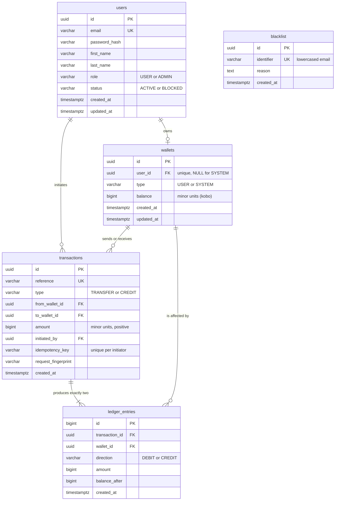

# Database Schema

PostgreSQL 18. Five tables: three for identity and money, one for the audit
trail, one for the blacklist.

## Guiding principle

**The database is the last line of defence, not a dumb store.** Application code
validates for good error messages, but every rule that must never be broken is
also a constraint. If a bug ever gets past the service layer, Postgres refuses
the write rather than silently corrupting a balance.

## Entity relationships



Read it as: a user owns at most one wallet. A transaction always names two
wallets (a source and a destination) and produces exactly two ledger entries,
a DEBIT against the source and a CREDIT to the destination, of equal amount.


## Tables

### `users`

Identity and credentials. `status` drives block/unblock; `role` separates
administrative actions (crediting a wallet, blocking a user) from ordinary
account holders.

Both are constrained string columns rather than booleans. `status` as
`ACTIVE | BLOCKED` extends to a third state without a migration, where
`is_blocked` would not.

### `wallets`

One wallet per user, enforced by a unique constraint on `user_id`.

`balance` is **`BIGINT` holding integer minor units**, kobo. ₦1,000 is stored
as `100000`. Money is never held in a floating point type: binary floats cannot
represent decimal fractions exactly, so repeated arithmetic drifts. Formatting
into naira happens at the API boundary, never in the database.

`user_id` is nullable because of the **SYSTEM wallet**: a single wallet owned by
no user, which acts as the counterparty for funds entering the closed system.
Crediting a user is therefore a transfer from SYSTEM rather than a bare balance
increment, so every ledger entry has two sides and funding shares one code path
with transfers.

The SYSTEM wallet is the only wallet permitted a negative balance, and it is
**seeded with a balance of zero**. It is not pre-funded with some large notional
amount: it goes negative as money is issued, and its negative balance is
therefore exactly the total in circulation. That yields a useful invariant:
**the sum of all balances, including SYSTEM, is always exactly zero.**

Seeding it with an arbitrary large positive balance instead would work, but it
would impose a meaningless ceiling on total issuance and the invariant would
become "balances sum to the seeded amount", which is a weaker assertion to test
against. Starting at zero models the SYSTEM account as what it actually is: a
liability position, not a vault of cash.

In a production ledger this single account would be a chart of accounts, with
separate settlement, revenue and payable accounts, but the invariant is
identical.

### `transactions`

The business event: one row per movement of money.

**There is deliberately no `status` column.** The row is written inside the same
database transaction as the balance updates, so if the row exists the money
moved, and a status column could only ever hold one value. A `PENDING` state
becomes necessary the moment an external payment provider is involved, where a
timeout leaves the outcome genuinely unknown. See [Out of scope](#out-of-scope).

`idempotency_key` is unique per initiator and carries the replay protection.
Uniqueness is enforced by the database rather than by application code checking
first, because a check-then-insert leaves a window for a concurrent duplicate to
slip through. Scoping it to `initiated_by` stops one user consuming another's key
namespace.

`request_fingerprint` is a hash of the request that first used the key. If the
same key arrives with a different payload that is a client bug, and returning the
original result would silently misreport what happened, so it is rejected as a
conflict instead.

### `ledger_entries`

The accounting effect: **exactly two rows per transaction**, a DEBIT and a CREDIT
of equal amount, so every movement nets to zero.

Append-only. The wallet `balance` column is a *cache* of this table, maintained
in the same database transaction. If the two ever diverge, the ledger is the
truth and balances can be rebuilt from it, which is what a reconciliation job
would do.

`balance_after` records each wallet's balance immediately after the entry, so the
audit trail is readable without replaying the whole ledger.

### `blacklist`

Checked at registration. Identifiers are stored lowercased; the service
normalises before querying.

Backed by a local table for this exercise. The service layer reads it through an
interface, so substituting the Lendsqr Adjutor Karma API is a second
implementation rather than a change to the registration flow.

## Constraints, and proof that they work

Every constraint below was verified by attempting to violate it directly in
`psql`, bypassing the application entirely.

| Constraint | Rule | Result |
| --- | --- | --- |
| `user_wallet_never_negative` | A USER wallet cannot go below zero | rejected |
| (same constraint) | A SYSTEM wallet may go negative | allowed |
| `wallets_one_system_wallet` | Only one SYSTEM wallet can exist | rejected |
| `wallets_user_required` | USER wallets need an owner; SYSTEM must not have one | rejected |
| `users_role_valid` | `role` must be USER or ADMIN | rejected |
| `users_status_valid` | `status` must be ACTIVE or BLOCKED | rejected |
| `transactions_no_self_transfer` | Source and destination must differ | rejected |
| `transactions_amount_positive` | Amount must be greater than zero | rejected |
| `transactions_idempotency` | `(initiated_by, idempotency_key)` is unique | rejected |
| `transactions_reference_unique` | References are unique | rejected |
| `ledger_direction_valid` | Direction must be DEBIT or CREDIT | rejected |
| `blacklist_identifier_unique` | Identifiers are unique | rejected |

## Indexes

Beyond the primary keys and unique constraints:

| Index | Supports |
| --- | --- |
| `ledger_entries_wallet_time` | A wallet's history, newest first |
| `ledger_entries_transaction` | Fetching both sides of one transaction |
| `transactions_from_wallet` / `transactions_to_wallet` | Locating a wallet's transactions |

## Types

**UUID primary keys** on externally visible entities. Sequential integers invite
enumeration of other users' resources; authorisation is enforced regardless, but
there is no reason to publish a map. `ledger_entries` uses `BIGSERIAL` because it
is never exposed and benefits from insertion-ordered locality.

**`BIGINT` for money**, as above. Note that `node-postgres` returns `BIGINT` as a
string by default to avoid silent precision loss; a type parser converts it to a
number, which is exact to roughly 90 trillion naira in kobo, far beyond anything
this service will hold, and keeps the domain layer free of string coercion.

**`TIMESTAMPTZ`** everywhere, never naive timestamps.

## Migrations

Plain JavaScript in `db/migrations/`, not TypeScript. The production image runs
compiled JavaScript and carries no TypeScript toolchain, so plain JS means **the
exact same migration files run in development, CI and production with no build
step in between**. Migrations are schema DSL calls, so the type-safety loss is
negligible.

They run automatically on deploy, as part of the container's start command:

```dockerfile
CMD ["sh", "-c", "npm run migrate && node dist/server.js"]
```

A failed migration therefore stops the deploy rather than serving traffic against
a half-migrated schema.

| Command | Purpose |
| --- | --- |
| `npm run migrate` | Apply pending migrations |
| `npm run migrate:rollback` | Roll back the last batch |
| `npm run migrate:status` | Show what has and has not run |
| `npm run seed` | System wallet and admin user |
| `npm run db:reset` | Roll back everything, re-migrate, re-seed |

## Seeds

**`01_system_wallet.js`** creates the single SYSTEM wallet. Idempotent.

**`02_admin_user.js`** creates one administrator from `ADMIN_EMAIL` and
`ADMIN_PASSWORD`, with a bcrypt hash at cost factor 12. The seed **throws** if
`NODE_ENV=production` and the password is still the development default, so a
deployed environment cannot end up with a known admin password.

## Deliberately absent

| Not built | Why |
| --- | --- |
| `status` on transactions | Written in the same transaction as the balances; only one value is reachable |
| `currency` | Single-currency closed system. A column plus an equality check per transfer is cost without a requirement |
| Soft deletes | Nothing in the brief deletes anything; a ledger is append-only by design |
| Separate `idempotency_keys` table | A unique constraint on `transactions` achieves the same thing with one fewer table |
| Multiple wallets per user | The brief specifies a wallet per account. The unique constraint documents the assumption and is trivial to relax |

Each of these is a choice, not an oversight. The brief asks for production-grade
code *without over-engineering*, so restraint is part of the deliverable.

## Out of scope

Funds enter through an administrative credit endpoint. In a real system they
would arrive via a payment provider webhook after confirmed settlement, which
changes the model significantly: a transfer would need a `PENDING` state, an
idempotency key sent *to* the provider, a requery job to resolve unknown
outcomes, and end-of-day reconciliation against the provider's settlement report.

A provider call that times out has not failed. It has an unknown outcome, and
retrying it without an idempotency key charges the customer twice. That is where
the real complexity of payments lives, and none of it is required for transfers
inside a single system.
